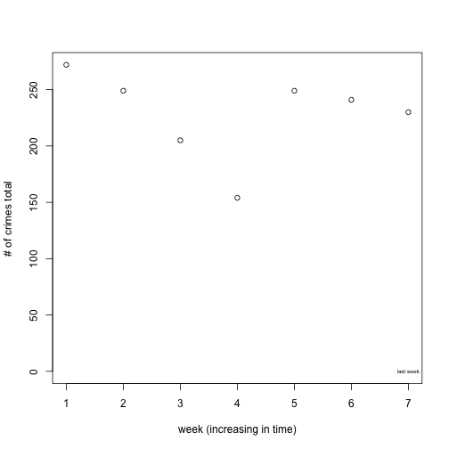
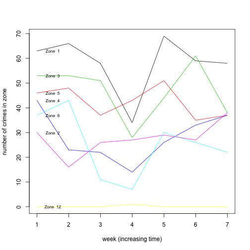

This is a report for the week


```
## [1] "2015-04-20 20:00:00 EDT"
```

```
## [1] "2015-04-27 20:00:00 EDT"
```


# Overview

This is the total number of crimes for every week.




# Crime types with high rates

Here we list the crime types that had surprisingly high rates this week. We are interested if there is a crime type that is larger in the most recent week than in any of the weeks before. We list those in the table below. 


|section |description       | count| increase.over.max| historical.average|
|:-------|:-----------------|-----:|-----------------:|------------------:|
|3304    |Criminal mischief |    15|                 1|              12.00|
|2709    |Harassment        |    65|                 2|              49.50|
|3701    |Robbery           |    12|                 3|               7.17|
|2501    |Homicide          |     3|                 1|               0.83|

# Historical statistics in zones

In the following figure we list the number of commited crimes in every one of the six zones. The figure shows how the total number of crimes has developed over time in each zone. 



# Percentage changes

We then calculate how much the current week differs from the historical averages of relevant attributes. This is a percent difference.


We see that the percent increase of the crime types over the historical average roughly matches with the table of crime types to watch, because they exeeded their historical high.


|          | percent increase|type                                 |
|:---------|----------------:|:------------------------------------|
|2501      |       162.500000|Homicide                             |
|3701      |        52.727273|Robbery                              |
|3929      |        40.000000|Retail theft                         |
|3304      |        25.690608|Criminal mischief                    |
|3921(a)   |        23.529412|Theft of movable property            |
|2709      |        20.689655|Harassment                           |
|2702      |        12.345679|Aggravated assault                   |
|3921      |         1.379310|Theft                                |
|3934      |        -3.289474|Theft from a motor vehicle           |
|13(a)(30) |        -4.938272|Possession w/ intent to deliver      |
|13(a)(16) |       -20.253165|Possession of a controlled substance |
|3502      |       -38.750000|Burglary                             |
|2701      |       -54.437870|Simple assault                       |

The percentage increases in the zones with respect to the historical average are the following:


|     2|     4|     1|     6|      5|     3|   12|
|-----:|-----:|-----:|-----:|------:|-----:|----:|
| 37.82| 30.81| -0.25| -12.5| -12.79| -18.9| -100|

We compare this to the ten neighborhoods with the largest increase in the last week and the zones that they are in:


|                   | percent increase|zone |
|:------------------|----------------:|:----|
|Arlington Heights  |           600.00|3    |
|Strip District     |           409.09|2    |
|South Shore        |           366.67|3    |
|Crawford-Roberts   |           273.33|2    |
|South Oakland      |           250.00|4    |
|Summer Hill        |           250.00|1    |
|Point Breeze North |           166.67|4    |
|Oakwood            |           133.33|6    |
|Stanton Heights    |           133.33|5    |
|Homewood West      |           133.33|5    |
